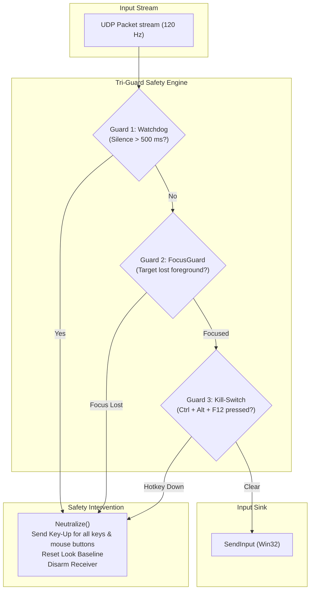
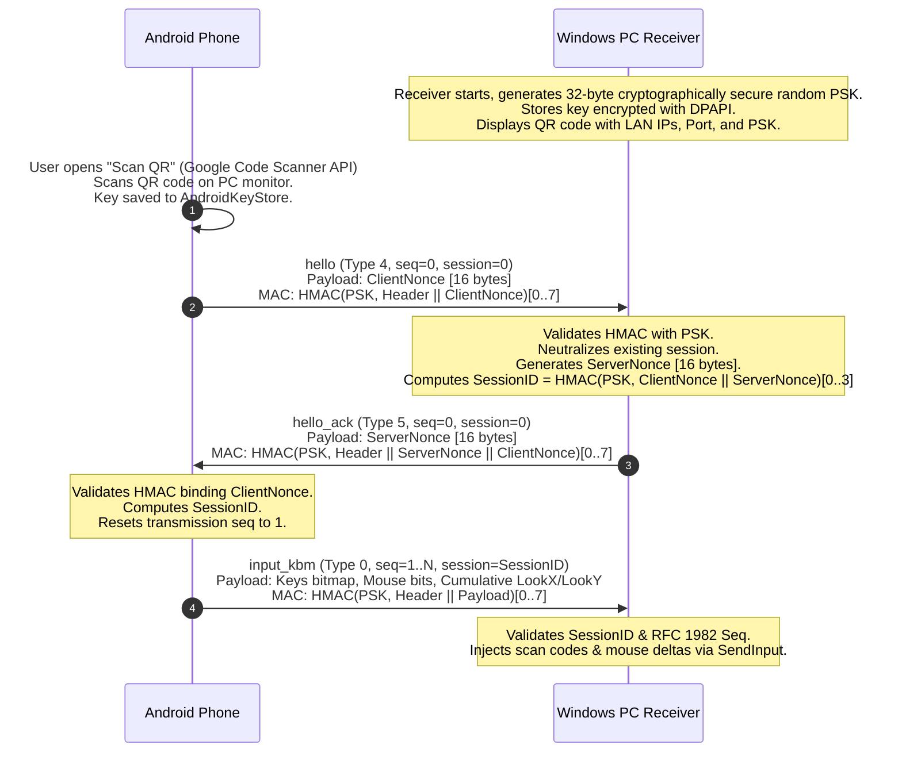

<!--
@aegis-contract
@claim Phone-as-Gamepad Authoritative User and Technical Manual
@true Comprehensively covers all 14 mandatory specification topics in PLAN.md Rev 4 Section 31
@true Documents Tri-Guard safety architecture, anti-cheat advisories, pairing protocol, gyro integration, firewall configuration, and uninstallation
@false Contains placeholder stubs, missing configuration instructions, or undocumented safety mechanisms
-->

# Phone-as-Gamepad: Mobile Touch HUD for Windows Games

[](docs/protocol.md)
[-512BD4.svg)](windows-receiver/)
[-3DDC84.svg)](android-controller/)
[](LICENSE)

**Phone-as-Gamepad** transforms your Android smartphone into an ultra-low-latency, multi-touch battle-royale controller for Windows 11 PC shooters. Featuring a PUBG Mobile style HUD, cumulative 120 Hz look streaming, angular rate gyroscope aim integration, and hardware scan-code injection via Win32 `SendInput`, it brings the precision and fluidity of mobile claw grips to PC gaming over local Wi-Fi.

---

## Interactive HUD & Protocol Simulator

Before compiling, test the touch HUD, layout editor, and receiver companion dashboard in your browser:
- Open [`docs/ui-mockup.html`](docs/ui-mockup.html) in any modern browser.
- Try multi-touch thumbstick movement, look zone swiping, ADS toggle, and fire-and-drag recoil compensation.
- Inspect, drag, and resize controls with live JSON export matching [`docs/layout-format.md`](docs/layout-format.md).
- Test the Tri-Guard safety architecture (Watchdog, FocusGuard, and `Ctrl+Alt+F12` Emergency Kill-Switch).

---

## Table of Contents

1. [Installation & Build Guide](#1-installation--build-guide)
2. [Target Game Selection & Arming the Receiver](#2-target-game-selection--arming-the-receiver)
3. [The Tri-Guard Safety Architecture](#3-the-tri-guard-safety-architecture)
4. [Anti-Cheat & Account Safety Warning](#4-anti-cheat--account-safety-warning)
5. [Elevated Games & UIPI Privilege Handling](#5-elevated-games--uipi-privilege-handling)
6. [Cryptographic Pairing & Handshake Workflow](#6-cryptographic-pairing--handshake-workflow)
7. [Default PUBG Mobile HUD Controls & Bindings Table](#7-default-pubg-mobile-hud-controls--bindings-table)
8. [Rebinding Keys & Customizing Layout Profiles](#8-rebinding-keys--customizing-layout-profiles)
9. [Gyroscope Setup, Rate Integration & Bias Calibration](#9-gyroscope-setup-rate-integration--bias-calibration)
10. [Windows "Enhance Pointer Precision" Guidance](#10-windows-enhance-pointer-precision-guidance)
11. [Windows Defender Firewall Setup Script](#11-windows-defender-firewall-setup-script)
12. [Network Recommendations & Low-Latency Tuning](#12-network-recommendations--low-latency-tuning)
13. [Known Game Compatibility & Haptic Limitations](#13-known-game-compatibility--haptic-limitations)
14. [Uninstallation & Security Key Cleanup](#14-uninstallation--security-key-cleanup)
15. [Technical Documentation Index](#15-technical-documentation-index)

---

## 1. Installation & Build Guide

The system consists of two companion applications: the **Windows Receiver** (WPF / .NET 10 LTS) and the **Android Controller** (Kotlin / Jetpack Compose).

### Windows Receiver Prerequisites & Build
- **Operating System:** Windows 11 (Version 22H2 or later recommended).
- **Runtime / SDK:** [.NET 10 LTS SDK](https://dotnet.microsoft.com/download/dotnet/10.0) (`net10.0-windows`).
- **Build Steps:**
  ```powershell
  # Clone repository and enter Windows receiver directory
  cd windows-receiver

  # Restore dependencies and build release binary
  dotnet build -c Release

  # Run receiver
  dotnet run --project src/Receiver/Receiver.csproj -c Release
  ```

### Android Controller Prerequisites & Build
- **Device Requirements:** Android phone running Android 8.0 (API level 26) or higher.
- **Sensors:** 3-axis Gyroscope and Accelerometer (required for motion aiming).
- **Development Tooling:** Android Studio Ladybug (or newer) with JDK 17.
- **Build Steps:**
  ```bash
  # Enter Android controller directory
  cd android-controller

  # Build standalone unsigned debug APK
  ./gradlew assembleDebug

  # Install directly to connected device over USB/ADB
  adb install -r app/build/outputs/apk/debug/app-debug.apk
  ```

---

## 2. Target Game Selection & Arming the Receiver

To eliminate accidental typing into desktop applications, email clients, or IDEs, the Windows receiver enforces an **Explicit Target Process Lock**:

```
[System Tray / Receiver Window]
       |
       +---> 1. Select Process from Running Windows (e.g., "Deadlock.exe")
       |
       +---> 2. Click "ARM RECEIVER" (or press global hotkey)
       |
       +---> 3. Input injection is active ONLY when target window owns foreground focus
```

1. Launch your target game on PC.
2. Open the Windows Receiver dashboard from the system tray.
3. In the **Target Process** dropdown, select your running game executable (e.g. `PUBG.exe`, `Deadlock.exe`, `Cyberpunk2077.exe`).
4. Toggle the **ARMED** switch. The tray icon transitions from red (Disarmed) to green (Armed).
5. The receiver will now accept validated, authenticated UDP packets and inject keyboard scan codes and mouse movement into the selected game.

> [!TIP]
> The receiver cannot be armed until a target process is explicitly chosen. While an *"Any Window (Global)"* mode is available for general desktop testing, it is disabled by default to protect your system.

---

## 3. The Tri-Guard Safety Architecture

Stuck software keys can corrupt game state, cause runaway movement, or deplete ammunition. Phone-as-Gamepad implements a multi-layered hardware-grade safety system known as **Tri-Guard**:



### Layer 1: The 500 ms Watchdog Timer
The receiver maintains an internal microsecond timer reset by every cryptographically valid `input_kbm` packet. If no valid packet arrives for **500 ms** (caused by Wi-Fi packet drop, mobile OS suspension, or phone crash), the receiver triggers `Neutralize()`, immediately releasing every currently held keyboard key and mouse button.

### Layer 2: FocusGuard (HWND Foreground Verification)
The receiver polls `GetForegroundWindow()` on every tick. If the user Alt-Tabs out of the game, if an overlay opens (Discord, Steam, Xbox Game Bar), or if the game crashes, FocusGuard intervenes within 8 ms:
- All held inputs are immediately released via `Neutralize()`.
- Input injection halts completely until the target game re-acquires foreground focus.
- The receiver transmits a `status` packet (Type 8) to the phone, causing the phone HUD to display a prominent yellow `PAUSED (GAME OUT OF FOCUS)` overlay.

### Layer 3: System-Wide Emergency Kill-Switch (`Ctrl + Alt + F12`)
A global low-level Windows hotkey (`Ctrl + Alt + F12`) is registered at launch. In the event of any unexpected behavior:
1. Press **`Ctrl + Alt + F12`** on your physical PC keyboard at any time.
2. The receiver disarms instantly, releases all pressed keys, and reverts to safe idle mode.

### Additional Safety Enforcements:
- **Graceful Disconnect (`bye`):** When the Android app is closed, minimized, or the screen locks, it transmits a signed `bye` datagram (Type 6) and neutralizes local state.
- **Session Preemption:** Establishing a new session via QR pairing or reconnection immediately clears the prior session and executes `Neutralize()`.
- **Minimum Key Hold Timer (30 ms):** To prevent 60 Hz game engines from dropping sub-frame taps, the receiver ensures keys remain held for at least 30 ms before injecting key release (except during safety neutralization, which acts instantly).

---

## 4. Anti-Cheat & Account Safety Warning

> [!WARNING]
> **PLEASE READ BEFORE USING IN ONLINE GAMES**
> 
> Games utilizing ring-0 / kernel-level anti-cheat drivers (e.g. **BattlEye**, **Easy Anti-Cheat**, **Riot Vanguard**, **Ricochet**, **EA Anti-Cheat**) actively monitor synthetic input calls generated by the Win32 `SendInput` API.
> 
> While Phone-as-Gamepad **never** automates gameplay (no macros, no aim assistance, no recoil reduction scripts, and 1:1 human touch forwarding only), anti-cheat engines cannot distinguish between legitimate touch controllers and automated cheating software. 
> 
> - **Only use in Offline, Practice, Training Range, or Single-Player modes** until the anti-cheat stance for your target title is established.
> - **Never use in competitive, ranked, or tournament matches.**
> - The end user assumes all risks regarding account penalties or suspensions resulting from software injection.
> - If a game strictly blocks software `SendInput`, use the virtual Xbox 360 controller fallback (`GamepadSink` via ViGEmBus, Phase 8) which interfaces as a physical game controller.

---

## 5. Elevated Games & UIPI Privilege Handling

Windows implements **User Interface Privilege Isolation (UIPI)** to prevent standard integrity processes from sending synthetic messages or keystrokes to elevated (Administrator) windows:

- If your game is launched with **"Run as Administrator"** (or launched via an elevated launcher like Steam, Battle.net, or Riot Client running as Admin), standard `SendInput` calls are silently dropped by the Windows kernel.
- **Remedy:** Right-click the Windows Receiver executable and select **"Run as Administrator"**.
- The receiver automatically inspects the target process token integrity level upon selection and displays an elevated warning icon if administrative permissions are required.

---

## 6. Cryptographic Pairing & Handshake Workflow

Phone-as-Gamepad operates over trusted Local Area Networks (LAN) and uses a pre-shared key (PSK) model with HMAC-SHA256 authentication:



### Step-by-Step Pairing Instructions:
1. Open the Windows Receiver dashboard and click **"Show Pairing QR Code"**.
2. Launch the Android app and tap **"Pair Receiver"**.
3. Point your camera at the screen. The app uses the **Google Code Scanner** (no invasive OS camera permissions required; scanning occurs out-of-process).
4. The client extracts the PC's IP endpoints, UDP port (`47789`), and the 32-byte hex secret key.
5. The pairing secret is persisted:
   - On Windows: Protected with **Windows DPAPI** (`ProtectedData.Protect`) at `%LocalAppData%\PhoneAsGamepad\receiver.dat`.
   - On Android: Protected with **AndroidKeyStore** AES-256-GCM hardware encryption.
6. The cryptographic handshake completes in under 200 ms. Once paired, the phone automatically re-connects whenever the app is opened on the same network.

---

## 7. Default PUBG Mobile HUD Controls & Bindings Table

The default layout implements the tournament-standard claw layout defined in [`docs/layout-format.md`](docs/layout-format.md) and [`docs/keys.md`](docs/keys.md):

| Control ID | HUD Label | Default Key | Scan Code | Mouse Button | Behavior | Position (X%, Y%) | Size / Diameter |
|---|---|---|---|---|---|---|---|
| `ms` | **Move Stick** | W / A / S / D | `0x11` `0x1E` `0x1F` `0x20` | None | Stick (0.35 Deadzone) | (16.0%, 66.0%) | 17.0% screen width |
| `run` | **Sprint Lock** | Left Shift | `0x2A` | None | Toggle | (16.0%, 34.0%) | 5.6% screen width |
| `lfire` | **Left Fire** | None | None | LMB | Hold | (31.0%, 58.0%) | 9.0% screen width |
| `rfire` | **Right Fire & Look** | None | None | LMB | Hold + Drag Look | (86.0%, 64.0%) | 14.0% screen width |
| `scope` | **ADS / Aim** | None | None | RMB | Toggle | (73.0%, 47.0%) | 8.0% screen width |
| `jump` | **Jump** | Space | `0x39` | None | Hold | (94.0%, 38.0%) | 8.0% screen width |
| `crouch` | **Crouch** | C | `0x2E` | None | Hold | (76.0%, 84.0%) | 7.0% screen width |
| `prone` | **Prone** | Z | `0x2C` | None | Hold | (95.0%, 88.0%) | 7.0% screen width |
| `leanl` | **Lean Left** | Q | `0x10` | None | Hold | (62.0%, 32.0%) | 6.0% screen width |
| `leanr` | **Lean Right** | E | `0x12` | None | Hold | (70.0%, 32.0%) | 6.0% screen width |
| `reload` | **Reload** | R | `0x13` | None | Hold | (64.0%, 68.0%) | 6.4% screen width |
| `use` | **Interact / Use** | F | `0x21` | None | Hold | (58.0%, 54.0%) | 6.4% screen width |
| `s1` | **Primary Weapon 1** | 1 | `0x02` | None | Hold | (38.0%, 15.0%) | 6.0% screen width |
| `s2` | **Secondary Weapon 2** | 2 | `0x03` | None | Hold | (44.5%, 15.0%) | 6.0% screen width |
| `s3` | **Melee / Sidearm** | 3 | `0x04` | None | Hold | (51.0%, 15.0%) | 6.0% screen width |
| `gren` | **Throwable / Grenade**| G | `0x22` | None | Hold | (58.0%, 15.0%) | 6.0% screen width |
| `heal` | **Medical / Heal** | 5 | `0x06` | None | Hold | (65.0%, 15.0%) | 6.0% screen width |
| `map` | **Map** | M | `0x32` | None | Hold | (84.0%, 12.0%) | 5.4% screen width |
| `bag` | **Inventory / Bag** | Tab | `0x0F` | None | Hold | (91.0%, 12.0%) | 5.4% screen width |
| `gyro` | **Gyro Toggle** | None | None | None | Toggle Chip | (50.0%, 90.0%) | 15.0% x 4.8% |
| **Look Zone** | **Look / Aim Area** | None | None | Relative Move | Continuous Pan | `x = 42%` to `100%` | Full vertical height |

---

## 8. Rebinding Keys & Customizing Layout Profiles

Every control on the screen can be moved, resized, rebound to any keyboard scan code or mouse button, and configured with custom activation behaviors.

### Profile Storage & JSON Schema
Layout profiles adhere strictly to the JSON schema in [`docs/layout-format.md`](docs/layout-format.md). You can export and import custom layouts across devices:

```json
{
  "profileName": "Tactical Arena Profile",
  "version": 1,
  "settings": {
    "touchSensitivity": 1.2,
    "adsSensitivityMultiplier": 0.5,
    "gyroEnabled": true,
    "gyroSensitivity": 1.4,
    "stickDeadzone": 0.30,
    "stickFloatingOrigin": true
  },
  "controls": [
    {
      "id": "crouch",
      "type": "button",
      "label": "Slide / Crouch",
      "boundKeyId": 39,
      "boundMouseButton": "none",
      "behavior": "tap",
      "x": 78.0,
      "y": 80.0,
      "width": 8.0,
      "height": 8.0,
      "opacity": 0.85
    }
  ]
}
```

### Behavior Modes:
- **`hold`:** Injects `KeyDown` when finger touches down, injects `KeyUp` when released.
- **`toggle`:** Alternates held state on each tap (ideal for ADS or run lock).
- **`tap`:** Injects a brief 30 ms pulse on touch (ideal for games where keys toggle engine stances).

---

## 9. Gyroscope Setup, Rate Integration & Bias Calibration

Motion aiming allows fine target tracking by tilting the phone. Unlike traditional mobile games that use game rotation vectors (which suffer from gimbal lock and sensor drift), Phone-as-Gamepad uses **raw angular rate integration**:

```
[Phone Gyroscope] ---> Sensor Event (rad/s)
                             |
                   Remap Axes for Landscape
                             |
                   Zero-Bias Calibration Filter
                             |
                   Deadzone & Low-Pass Filter
                             |
                   Sensitivity & ADS Multipliers
                             |
                   Integrate: LookX += w_yaw * dt
                              LookY += w_pitch * dt
                             |
                   Append to Cumulative Look Counters (input_kbm)
```

### Calibration Procedure:
1. Place your phone flat on a motionless desk or table.
2. In the app settings, tap **"Calibrate Gyroscope Bias"**.
3. Keep the phone still for 3 seconds while the app samples 600 readings to calculate static sensor bias offsets $(\epsilon_x, \epsilon_y, \epsilon_z)$.
4. Offsets are stored in flash and automatically subtracted from real-time angular velocity.

### Activation Modes:
- **Always On:** Motion aiming is active at all times.
- **ADS Only:** Motion aiming activates only while Aim-Down-Sights (`scope` RMB) is toggled on.
- **Toggle Chip:** Tap the `Gyro` chip on the bottom center of the HUD to toggle motion on/off on the fly.

---

## 10. Windows "Enhance Pointer Precision" Guidance

Windows includes a legacy mouse acceleration feature called **"Enhance pointer precision"**. When enabled, Windows applies a non-linear velocity curve to relative mouse inputs. In games that do not consume raw DirectInput or Raw Input, this causes erratic camera acceleration when using touch or gyro aiming.

### How to Disable Mouse Acceleration:
1. Press `Win + R`, type `main.cpl`, and press **Enter** (opens Mouse Properties).
2. Click the **Pointer Options** tab at the top.
3. Under the **Motion** section, uncheck **"Enhance pointer precision"**.
4. Set the pointer speed slider to the **6th notch (exact center)** for true 1:1 hardware translation.
5. Click **Apply** and **OK**.

---

## 11. Windows Defender Firewall Setup Script

The Windows Receiver listens for incoming UDP packets on port `47789`. Windows Defender Firewall will block inbound UDP traffic from local subnets by default.

A PowerShell automation script is provided in the repository to create the required firewall rule:

### Running the Setup Script:
Open PowerShell as **Administrator** and run:
```powershell
Set-ExecutionPolicy -ExecutionPolicy RemoteSigned -Scope Process
& .\windows-receiver\scripts\setup-firewall.ps1
```

### Script Contents (`windows-receiver/scripts/setup-firewall.ps1`):
```powershell
<#
.SYNOPSIS
    Configures Windows Defender Firewall inbound rule for Phone-as-Gamepad UDP listener (Port 47789).
#>
param(
    [int]$Port = 47789,
    [string]$RuleName = "Phone-as-Gamepad Receiver (UDP-In 47789)"
)

$existingRule = Get-NetFirewallRule -DisplayName $RuleName -ErrorAction SilentlyContinue

if ($existingRule) {
    Write-Host "[Firewall] Rule '$RuleName' already exists." -ForegroundColor Green
} else {
    try {
        New-NetFirewallRule -DisplayName $RuleName `
                            -Direction Inbound `
                            -LocalPort $Port `
                            -Protocol UDP `
                            -Action Allow `
                            -Description "Allows incoming 120 Hz UDP control packets for Phone-as-Gamepad." `
                            -ErrorAction Stop
        Write-Host "[Firewall] Successfully created inbound firewall rule for UDP port $Port." -ForegroundColor Green
    } catch {
        Write-Warning "[Firewall] Failed to create firewall rule. Ensure this script is run as Administrator."
        Write-Warning $_.Exception.Message
    }
}
```

---

## 12. Network Recommendations & Low-Latency Tuning

Achieving tournament-grade response times ($p95 < 15 \text{ ms}$) requires proper Wi-Fi environment configuration:

- **Connect Phone to 5 GHz (802.11ac / Wi-Fi 6) Wi-Fi:** 2.4 GHz bands suffer from severe packet jitter caused by Bluetooth and microwave interference.
- **Wire the PC via Ethernet:** Ensure the Windows PC is connected directly to your router via a Cat 5e / Cat 6 Ethernet cable. Avoid PC-side Wi-Fi.
- **Direct Wi-Fi Hotspot Option:** If a 5 GHz router is unavailable, enable the **5 GHz Mobile Hotspot** on your Android phone and connect your PC directly to the phone's Wi-Fi network. This achieves $< 4 \text{ ms}$ round-trip latency.
- **UDP Latest-State Advantage:** Phone-as-Gamepad does not retransmit lost UDP packets. Cumulative look counters ensure that even if intermediate packets are dropped, the next packet immediately catches up the camera with zero lost distance.

---

## 13. Known Game Compatibility & Haptic Limitations

### Tactile Feedback (Local Haptics vs Game Rumble)
- **Keyboard / Mouse Injection Mode:** PC game engines do not emit force feedback or rumble signals to keyboard and mouse peripherals.
- **Local Haptics:** The Android controller utilizes the phone's internal linear resonance actuator (haptic motor) via `VibratorManager` to provide instantaneous, crisp mechanical clicks when buttons are pressed or weapons are cycled.
- **Gamepad Mode (Phase 8 Fallback):** Dual-motor rumble is supported exclusively when operating in the optional virtual Xbox 360 controller mode via ViGEmBus.

### Tested Game Architectures:
- **Unreal Engine 4 & 5 (e.g. PUBG, Deadlock):** Fully compatible with scan-code injection and raw relative mouse deltas.
- **Source 2 (Counter-Strike 2):** Fully compatible; verify `m_rawinput 1` is enabled.
- **Apex Legends:** Requires Borderless Windowed mode; verify anti-cheat policies.
- **Cyberpunk 2077:** Excellent single-player testing ground for layout customization and gyro aiming.

---

## 14. Uninstallation & Security Key Cleanup

To completely remove Phone-as-Gamepad and wipe all stored cryptographic pairing secrets:

### 1. Remove Windows Receiver & Secrets
```powershell
# Remove encrypted DPAPI credentials and user profiles
Remove-Item -Recurse -Force "$env:LOCALAPPDATA\PhoneAsGamepad"

# Remove Windows Defender Firewall rule
Remove-NetFirewallRule -DisplayName "Phone-as-Gamepad Receiver (UDP-In 47789)"
```

### 2. Remove Android Controller App & Keystore Keys
1. On your Android phone, navigate to **Settings -> Apps -> Phone-as-Gamepad**.
2. Tap **Storage & Cache**, then tap **Clear Storage** (this purges encrypted credentials and hardware Keystore keys).
3. Tap **Uninstall**.

---

## 15. Technical Documentation Index

Detailed engineering specifications are maintained in the [`docs/`](docs/) directory:

- **[`docs/protocol.md`](docs/protocol.md):** Authoritative wire protocol specification, byte offsets, Little-Endian packing, and HMAC structure.
- **[`docs/keys.md`](docs/keys.md):** Immutable KeyId (0..127) to PS/2 Set 1 hardware scan codes and extended key flags.
- **[`docs/pairing.md`](docs/pairing.md):** Cryptographic handshake, nonce binding, DPAPI, and AndroidKeyStore specifications.
- **[`docs/layout-format.md`](docs/layout-format.md):** Touch layout JSON schema, normalized percentage coordinates, and default HUD definitions.
- **[`docs/ui-mockup.html`](docs/ui-mockup.html):** Standalone interactive browser-based simulator for controls, layout editor, and receiver dashboard.
