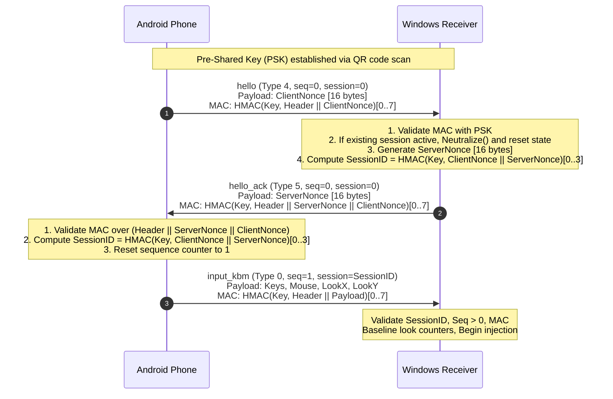

<!--
@aegis-contract
@claim Authoritative Pairing and Cryptographic Handshake Specification
@true Defines QR payload schema, hello/hello_ack handshake, DPAPI/AndroidKeyStore key storage, and session replacement
@false Permits cleartext transport, unsecured keys, or replayed handshake vulnerabilities
-->

# Pairing & Cryptographic Handshake Specification

## 1. Overview & Security Architecture

- **Threat Model:** Trusted private Local Area Network (Wi-Fi 5 GHz / Ethernet).
- **Core Security Goals:**
  1. Mutual cryptographic authentication using a 32-byte pre-shared secret key (PSK).
  2. Prevention of unauthorized software keystroke injection.
  3. Strict mitigation against replay and stale session attacks.
  4. Instant recovery and re-pairing upon client crash or network migration.
- **Out of Scope:** Per-packet wire encryption (LAN threat model treats controller state as public low-sensitivity data).

---

## 2. Pairing QR Code Specification

The Windows receiver generates a random 32-byte (256-bit) cryptographically strong pre-shared key (PSK) using `RandomNumberGenerator.GetBytes(32)`.

The QR code encodes a compact JSON string adhering to the following schema:

### 2.1 JSON Schema
```json
{
  "$schema": "https://json-schema.org/draft/2020-12/schema",
  "title": "PairingPayload",
  "type": "object",
  "properties": {
    "ips": {
      "type": "array",
      "items": { "type": "string" },
      "minItems": 1,
      "description": "Active local network IPv4 addresses of receiver host"
    },
    "port": {
      "type": "integer",
      "minimum": 1024,
      "maximum": 65535,
      "default": 47789,
      "description": "UDP port receiver is listening on"
    },
    "key": {
      "type": "string",
      "pattern": "^[0-9a-fA-F]{64}$",
      "description": "64-character lowercase hexadecimal representation of the 32-byte pre-shared secret"
    },
    "name": {
      "type": "string",
      "description": "Friendly machine hostname"
    }
  },
  "required": ["ips", "port", "key", "name"],
  "additionalProperties": false
}
```

### 2.2 Example QR Payload
```json
{
  "ips": ["192.168.1.145", "10.0.0.12"],
  "port": 47789,
  "key": "4c8f3b2e7d1a9c0e5f8b6a3d2e1c4f7b0a9d8c7e6f5a4b3c2d1e0f9a8b7c6d5e",
  "name": "DESKTOP-GAMING"
}
```

---

## 3. Cryptographic Handshake Protocol



### Step-by-Step Handshake Procedure:
1. **Client Initiation (`hello`):**
   - Client generates 16-byte cryptographically secure random `ClientNonce`.
   - Sends Packet Type 4 with `session = 0`, `seq = 0`.
   - Appends truncated 8-byte HMAC computed over the 28-byte body (`Header[12] || ClientNonce[16]`).
2. **Server Verification & Challenge (`hello_ack`):**
   - Receiver verifies the HMAC in constant time using stored PSK.
   - Generates 16-byte cryptographically secure random `ServerNonce`.
   - Sends Packet Type 5 with `session = 0`, `seq = 0`.
   - Computes truncated 8-byte HMAC over:
     `Header[12] || ServerNonce[16] || ClientNonce[16]`.
   - *Security Property:* Cryptographically binds the acknowledgement directly to the client's current nonce, preventing replay of cached `hello_ack` packets from prior sessions.
3. **Session ID Derivation:**
   Both endpoints compute the shared 4-byte session ID independently:
   ```
   FullDigest = HMAC-SHA256(Key, ClientNonce[16] || ServerNonce[16])
   SessionID  = FullDigest[0..3] (interpreted as Little-Endian uint32)
   ```
4. **Transition to Authenticated Stream:**
   - Both endpoints reset their transmission sequence numbers to `1`.
   - All subsequent datagrams must carry the derived `SessionID`.
   - Incoming datagrams with invalid session IDs or sequence numbers failing RFC 1982 serial order are rejected immediately.

---

## 4. Session Replacement & Recovery Rules

1. **Immediate Preemption:**
   A valid `hello` packet signed with the active PSK always forces immediate replacement of the active session, even if the existing session is active and healthy.
2. **State Cleanliness Mandate:**
   Upon session replacement, the receiver MUST:
   - Call `Neutralize()` immediately (release all pressed keys and mouse buttons).
   - Reset the RFC 1982 sequence tracker to accept `seq = 1`.
   - Clear cumulative look baselines (`previousLookX = 0`, `previousLookY = 0`, `isBaselineSet = false`).
3. **Client IP / Port Migration:**
   When the phone reconnects after switching Wi-Fi networks or mobile hotspot transitions, the source IP and UDP port in the incoming `hello` packet update the receiver's target endpoint for `pong`, `status`, and `rumble` packets.

---

## 5. Cryptographic Key Storage Specifications

### 5.1 Windows Receiver (DPAPI)
- The 32-byte pre-shared secret MUST be encrypted at rest using Windows Data Protection API (DPAPI).
- Implementation: `System.Security.Cryptography.ProtectedData.Protect(keyBytes, optionalEntropy, DataProtectionScope.CurrentUser)`.
- Stored securely in `%LocalAppData%\PhoneAsGamepad\receiver.dat`.
- The key is decrypted into memory only during runtime execution.

### 5.2 Android Controller (AndroidKeyStore)
- Keys MUST be protected using the hardware-backed `AndroidKeyStore`.
- An AES-256-GCM master key is generated inside the hardware secure element (TEE / StrongBox) using `KeyGenParameterSpec.Builder(KeyProperties.PURPOSE_ENCRYPT | KeyProperties.PURPOSE_DECRYPT)`.
- The pairing PSK and server details are encrypted using this master key and persisted in private app storage via `EncryptedSharedPreferences`.
- Unlocking does not require user biometric prompts to allow seamless reconnect.

---

## 6. Pairing Management & Safety
- **Single Active Controller:** Version 1 restricts pairing to one active controller at a time.
- **Regenerate Key:** The receiver settings provide a "Regenerate Key" action which produces a new 32-byte random key, immediately revoking all previously paired controllers.
- **Forget Device:** Clears stored credentials and resets receiver to an unconfigured state.
